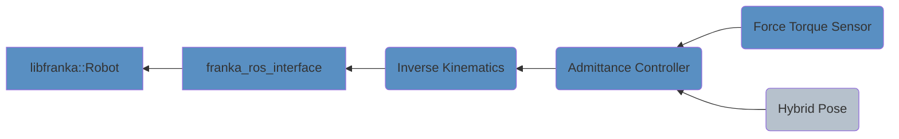
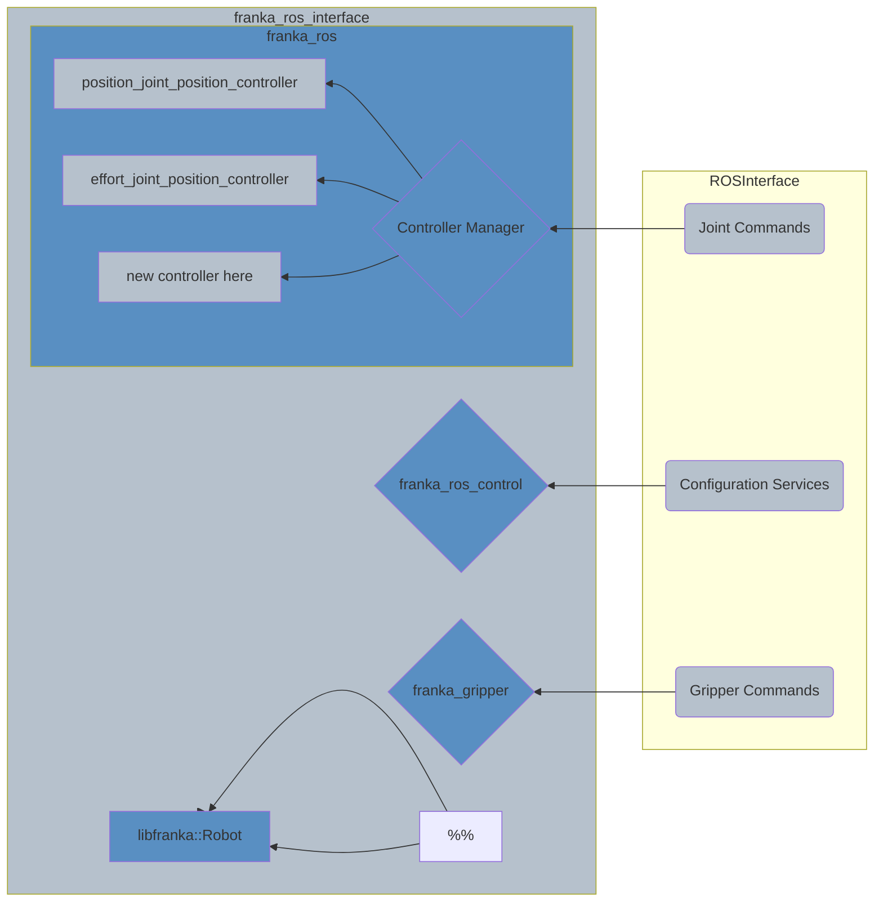

# Actuation

## Configuration

## Actuation Flowchart

### Low Level Control (Joint Commands)

Documentation for the standard nodes:
* [libfranka](https://frankaemika.github.io/docs/libfranka.html)
* [franka_control](https://frankaemika.github.io/docs/franka_ros.html#franka-control)
* [franka_gripper](https://frankaemika.github.io/docs/franka_ros.html#franka-gripper)

[franka_ros_interface](https://github.com/justagist/franka_ros_interface) was forked, and this repo contains a minimally modified version.
